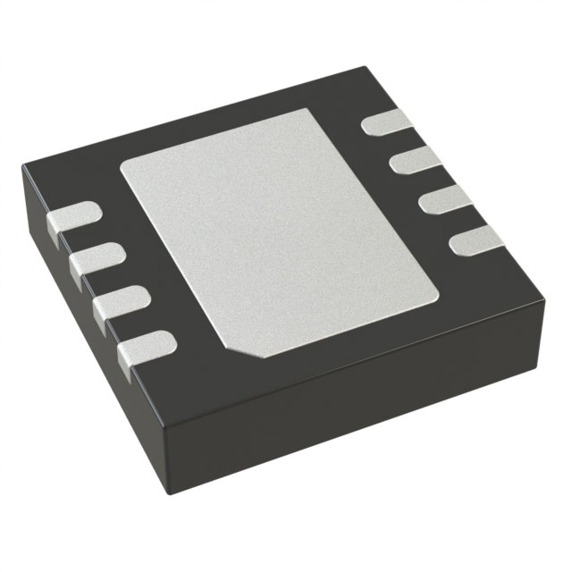
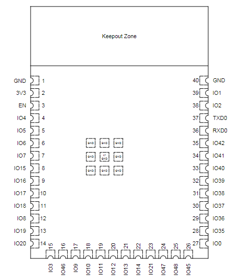
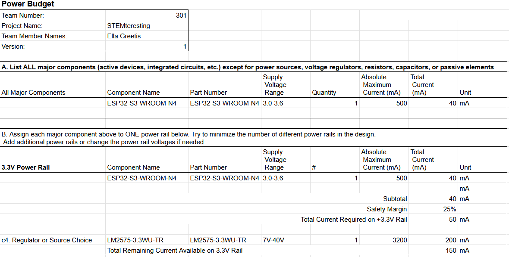

## Voltage Regulator
|Solution | Pros | Cons |
|------|------|------|
|   LM2575-3.3WU-TR   $1.75/ea   [digikey](https://www.digikey.com/en/products/detail/microchip-technology/LM2575-3-3WU-TR/1027646)| \* Equivalent to regulator used in class, so more familiar and easier to use than other options   \* Inexpensive | \* Less experience gained |
|   ADP2370ACPZ-3.3-R7   $6.14/ea   [digikey](https://www.digikey.com/en/products/detail/analog-devices-inc/ADP2370ACPZ-3-3-R7/3232861)| \* Exposed pads would be a new and enriching soldering challenge | \* Expensive   \* Least current|
|   TPS5403DR   $1.68/ea   [digikey](https://www.digikey.com/en/products/detail/texas-instruments/TPS5403DR/3671586)| \* Least expensive option   \* Most current | \* Unfamiliar|

### Selection
I chose the LM2575 because it's familiar from the Switching Power Supply lab. It's only a few cents more expensive than the TPS5403DR, and provides up to 1 Amp of current, which is far more than enough. 

### Major Components
|Component | Purpose | 
|----------|---------|
| ESP32-S1-WROOM | Bidirectional wireless communication, UART communication | 
| LM2575 | Switching Stepdown REgulator with input of 7-40V and output of 3.3V | 

## Microchip
### Requirements 
I will use an ESP32 microcontroller for this project because my subsystem requires the use of a wifi module. 
### ESP32
|Info  | Answer |
|-----|-----|
|Model |ESP32-S3-WROOM-1-N4|
|Datasheet|[link](documentation/esp32-s3-wroom-1_wroom-1u_datasheet_en.pdf)|
|Vendor Link|[Link](https://www.digikey.com/en/products/detail/espressif-systems/ESP32-S3-WROOM-1-N4/16162639)|
|Unit Cost|$5.06|
|Maximum Current|500 mA|
|Supply Voltage |3.0-3.6V|

### Pinout

### Pin Allocation
|Pin number | Name | Use|
|-----|-----|-----|
|1| GND |Ground|
|2| 3v3 |Power In|
|3| EN |reset button & RC circuit to stabilize input power|
|6|IO2 |Debugging Pushbutton|
|9| IO16 | RX2 |
|10| IO17 | TX2 |
|13|IO19 |USB_D-|
|14|IO20 |USB_D+|
|27|IO0 | BOOT Button|

### Decision-Making Process
I decided to use pins 16 and 17 as RX2 and TX2, rather than the originally planned RX0 and TX0, because the UART0 module is used for other important board processes I didn't want to overwrite. Initially I was unaware of the need for a BOOT button in flashing the ESP's firmware, and ended up having to solder a jumper wire to connect to ground for both the EN and BOOT pins. 

## Power Budget

This power budget was very useful in knowing how much power the board is supposed to handle. The system is not supposed to draw more than 0.5 Amperes at maximum, so when I was testing it with a power supply I knew a current reading of almost 1 Amp meant there was a short, somehow, within the ESP. 

This page is up-to-date as of May 05, 2025. 