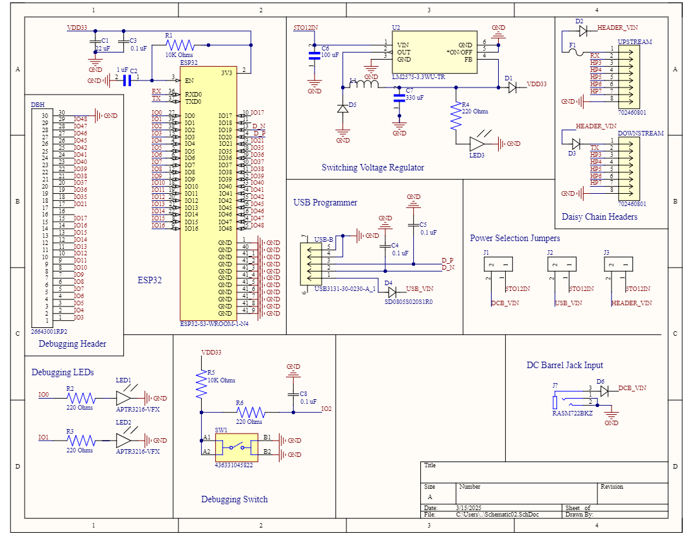
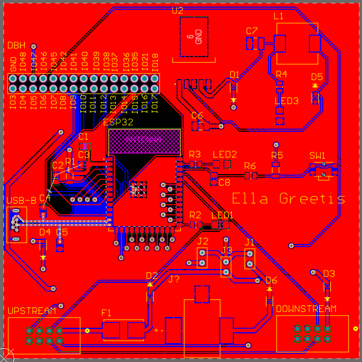
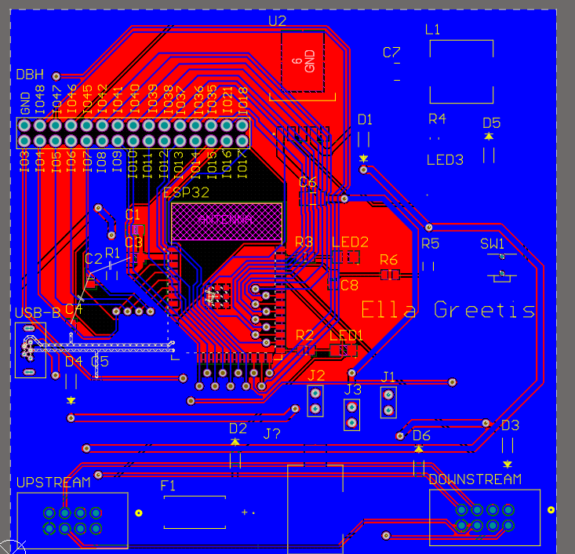

Download Schematic .pdf: [Schematic02.pdf](https://github.com/user-attachments/files/20052940/Schematic02.pdf)

Download Altium Project .zip: [altium_project_archive_may052025.zip](https://github.com/user-attachments/files/20052945/altium_project_archive_may052025.zip)

## PCB Front and Back
### PCB Front: 

### PCB Back: 

## Description of Function: 
This schematic consist of a USB programmer, an ESP32, two debugging LEDs, one debugging pushbutton, two ribbon-cable headers, and a switching power regulator capable of stepping 7-40 Volts down to a steady 3.3V. The USB Programmer facilitates connection between the ESP32 and a personal computer. The Power Regulator converts any voltage the board would receive (within 7-40 Volts) into a steady 3.3, protecting the ESP32 from voltage swings.

## Decision Making Process: 
I decided to use debugging LEDs and a debugging switch because they were mentioned in the assignment and I thought they would be a good idea. I added two debugging LEDs because I thought that would be sufficient.

## Improvements for a Version 2.0
If I were to make a version 2.0 of this board, I would, first of all, include the BOOT and Enable buttons as pushbuttons rather than jumper wires. 
I would also take additional measures to ensure that none of my ground planes were disconnected or on islands, as I believe the lack of connection on some of my capacitors' ground nets caused the ESP to experience unanticipated voltage spikes. I would prbably fix this by rerouting the traces or by adding some carefully placed vias. 
I would add more debugging LEDs, and redesign so that the pins meant to provide output to these LEDs no longer conflict with critical board functions, as seen with the BOOT button. 
I also think it would be nice to shrink the size of the board, decreasing the amount of blank space within it, and grouping the LEDs closer together. 
I would also label everything more comprehensively. With the version 1.0, I found myself needing a post-it note to keep track of which jumper switched which power supply (either the USB, the daisy chain, or the DC Barrel Jack) and which pin on my daisy-chain header corresponded to which pin on my teammates' daisy chain headers. There was a mix-up in the footprints for the daisy chain headers, which caused them to not all automatically correspond. 
Also, mysteriously, the DC Barrel Jack was nonfunctional. I believe there was a short somewhere within it, or that perhaps the footprint I downloaded from Digikey was incorrect. In later boards of the 1.0 design, I chose to exclude the Barrel Jack entirely.

This page is up-to-date as of March 05, 2025 and will continue to be updated throughout the semester. 
